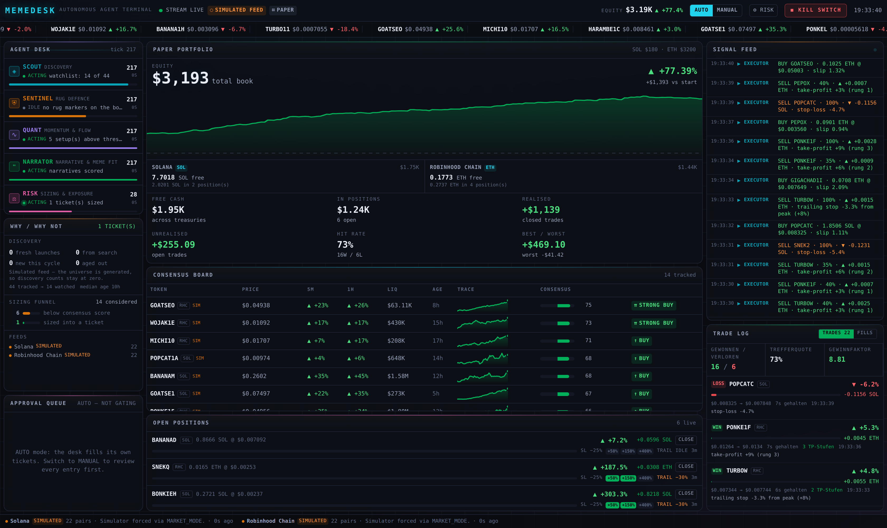

# MEMEDESK — Autonomous Memecoin Trading Terminal

Ein autonomes Multi-Agenten-Trading-Terminal für Memecoins. Sechs Agenten
beobachten den Markt gemeinsam, stimmen über Kandidaten ab und handeln
eigenständig — als **Paper-Trading auf echten On-Chain-Daten**.

Das Buch wird **pro Chain in deren eigenem Quote-Asset** geführt: Solana-Paare
in SOL, Robinhood-Chain-Paare in ETH. Kapital wandert nicht von selbst zwischen
Chains, und das Terminal tut auch nicht so.



## Schnellstart

```bash
npm install
npm run dev          # http://localhost:3000
```

Das war's — kein API-Key nötig. Das Terminal startet, verbindet sich mit
DexScreener und beginnt sofort zu handeln.

### Optionale Keys

```bash
cp .env.example .env.local
```

| Variable | Was es freischaltet |
|---|---|
| `BIRDEYE_API_KEY` | Holder-Konzentration (Top-10-Wallet-Anteil) für SENTINEL |
| `HELIUS_API_KEY` | Mint-/Freeze-Authority-Check → harte Veto-Signale |
| `ANTHROPIC_API_KEY` | NARRATOR lässt zusätzlich Claude die Story eines Tickers lesen |
| `MARKET_MODE` | `auto` (Standard), `live` oder `simulated` |
| `TICK_INTERVAL_MS` | Taktrate der Agenten (Standard 4000) |

Ohne Keys läuft alles vollständig — nur mit weniger Signalquellen.

## Befehle

```bash
npm run dev        # Entwicklungsserver
npm run build      # Produktions-Build
npm start          # Produktionsserver
npm test           # Unit-Tests (74)
npm run typecheck  # TypeScript ohne Emit
npm run phone         # LAN-URL + QR-Code fürs Handy
npm run check-sources # prüft alle Datenquellen von deinem Netz aus
npm run check-chains  # zeigt, welche Chains gerade live indiziert sind
```

## Woher die Token kommen

Zwei Quellen beantworten zwei verschiedene Fragen:

| Quelle | Frage | Key nötig |
|---|---|---|
| **pump.fun** (Solana) | Was wurde gerade gelauncht? | nein |
| **Neue Pools** (beide Chains) | Was ist gerade handelbar geworden? | nein |
| **DexScreener** | Was ist es wert, und wie tief ist der Pool? | nein |

Auf Robinhood Chain dominiert **Pons** die Launches — Ende August 2026 nahm es
mehr Launchpad-Gebühren ein als Pump.fun. Pons hat aber keine offene REST-API
(der dokumentierte Weg ist Bitquery-GraphQL und braucht einen Token), deshalb
werden Launches dort über den Pool erfasst, der entsteht, sobald ein Token
handelbar wird — der erste Moment, in dem der Desk ohnehin handeln könnte.

Das ist bewusst getrennt: Eine Textsuche kann neue Launches nicht finden — ein
Coin von vor zehn Minuten heißt nichts, wonach jemand sucht. Das Launchpad weiß,
was existiert; erst der Aggregator weiß, ob ein Pool tief genug ist, um wieder
herauszukommen. Preise und Liquidität kommen deshalb nie vom Launchpad.

`npm run check-sources` zeigt dir, welche Quelle von deinem Netz aus antwortet.

## Chain-Abdeckung

Unter welchem Slug eine Chain bei DexScreener geführt wird, erkennt der Adapter
selbst: Er probiert eine Kandidatenliste und rastet auf den ein, der antwortet.
Der erkannte Slug steht in der Statusleiste unten. Antwortet eine Chain gar
nicht, läuft sie sichtbar simuliert statt erfundene Zahlen als live auszugeben.

| Chain | Chain ID | Gas / Quote | RPC |
|---|---|---|---|
| Solana | — | SOL | `api.mainnet-beta.solana.com` |
| Robinhood Chain | 4663 | ETH | `rpc.mainnet.chain.robinhood.com` |

## Dauerbetrieb

```bash
docker compose up -d --build
```

Der Desk ist ein laufender Prozess, kein Request-Handler — **Serverless
funktioniert nicht** (Vercel, Netlify: die Tick-Schleife überlebt dort nicht).
Alles, was einen Container am Leben hält, geht: Raspberry Pi, VPS, Fly, Railway.

Der Zustand wird atomar nach `DATA_DIR` geschrieben und beim Start
wiederhergestellt. Details in [docs/BETRIEB.md](docs/BETRIEB.md).

## Sicherheit

Das Terminal handelt **ausschließlich mit virtuellem Kapital**. Es gibt keinen
Private Key, keine Wallet-Anbindung und keinen Code-Pfad, der eine echte
Transaktion signiert. Die Live-Execution-Schicht (`LiveSolanaExecutor`) ist
bewusst funktionslos und verweigert die Arbeit, solange kein Signer *und* ein
expliziter Opt-in-Flag gesetzt sind.

## Dokumentation

| Datei | Inhalt |
|---|---|
| **[docs/BETRIEB.md](docs/BETRIEB.md)** | **Dauerbetrieb** — Docker, systemd, Persistenz, Erreichbarkeit |
| **[docs/TERMINAL.md](docs/TERMINAL.md)** | **Die Oberfläche lesen** — was pro Tick passiert, jedes Panel, jede Zahl, jeder Marker, plus Symptom→Ursache-Tabelle |
| [PROJEKT.md](PROJEKT.md) | Architektur, Agenten, Entscheidungen, Tests, bekannte Grenzen |
